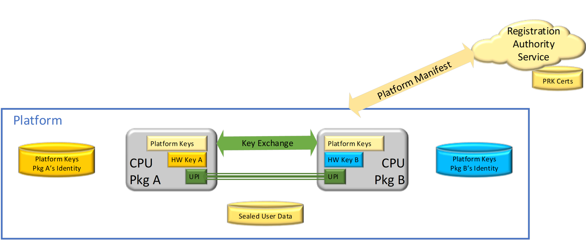

<!---
Copyright (C) 2025 Intel Corporation
SPDX-License-Identifier: CC-BY-4.0
-->

# Introduction

Intel® SGX remote attestation on multi-package platforms requires SGX instructions to use platform keys that are shared between CPU packages.
These platform keys are generated in the field when a platform is assembled and distributed to each CPU package on the platform.
The BIOS stores the platform keys for each CPU package that is encrypted by respective unique hardware key of each CPU package.
SGX attestation keys are certified with signing keys derived from the platform keys rather than a unique hardware key of a SGX CPU package.
This differs from a single package SGX platforms where the attestation keys are certified with signing keys that are derived from unique hardware key of the CPU package.

Because the platform keys are derived at platform assembly, the provisioning keys that are derived from the platform keys are not recognized by the attestation infrastructure and they must be registered.
A registration authority service evaluates whether each CPU package on the platform is a genuine SGX package in good standing using its database of hardware key certificates.
Then the registration authority service provides platform identity certificates to the attestation infrastructure.
Once when the platform is registered, it can perform remote attestation the same way the single package SGX platforms perform remote attestation is described in other Intel® SGX Data Center Attestation Primitive (DCAP) documentation.

This document provides information on the released Intel® SGX DCAP platform software and tools that support multi-package registration and a brief overview of the multi-package boot flows and components.

## Terminology

Table: Terminology

| | |
|-|-|
| Intel® SGX DCAP | Intel® Software Guard Extensions Data Center Attestation Primitives |
| Registration Authority Service | The Registration Authority Service is the foundation for provisioning and attesting multi-package platforms. The PCK Certificate Provisioning Service & attestation verifiers rely on the assertion of the Registration Server that this platform is trustworthy.  Intel hosts Intel® Registration Service for this purpose. |
| Registration Service Authentication Key (RSAK)  | Key that the registration authority service uses to sign authorizations to add new packages to the platform and its self-signed Registration Server ID structure.  |
| Registration Service Encryption Key (RSEK)  | The registration authority service’s 3072-bit RSA key used to encrypt/decrypt the platform keys.   |
| Registration Service Name (RSNAME)  | Self-selected public ID of the Registration Authority Service. Frequently the hash of the service domain name.  |
| Security Version Number (SVN) | Version number that indicates when security relevant updates have occurred.  New versions can have increased functional versions without incrementing the SVN. |
| Platform Key  | This 128-bit key is the foundation of the provisioning key derivations in a processor. Multi-package platforms negotiate platform keys in the field.  They are delivered to the registration authority service encrypted with the RSAK.  They are stored by each CPU package on the platform in the sealed and encrypted key blobs using its respective unique hardware key.  SGX Sealing Keys use the platform key in conjunction with another value that is unique to the platform instance.  The platform key alone is not enough to unseal enclave-sealed user data. |
| Hardware Key | This is the unique key that is available to the each SGX-capable CPU package.  It is derived directly from fuses and used to derive PRK signatures and key blob sealing keys. |
| Key Blob | Data Structure that stores the platform keys for each CPU device on the platform.  Each device uses a unique sealing key to encrypt the platform keys in the key blob.  Used by BIOS to determine the state of the platform keys. |
| Platform Manifest (PM) | The platform manifest allows the registration authority service to evaluate whether the platform and its components CPU packages are suitable for being certified as an SGX platform.  It contains the shared platform keys that are encrypted using the Registration Server’s Encryption Key (RSEK). |
| Provisioning Registration ID (PRID) | Unique 128-bit ID for each CPU package that is used for registration.   |
| Platform Registration Key (PRK) | Unique 3072-bit RSA key pair for each processor package that is used for Initial Platform Establishment, TCB Recoveries and Add Package boot flows. This key is TCB-specific.  It is used to sign the platform manifests. It is used in the protocol for establishing protected sessions between processors.  It is derived from the HW key. |
| Provisioning Certification Enclave (PCE) | Intel® SGX architectural enclave that uses a Provisioning Certification Key (PCK) to sign REPORT structures for Provisioning or Quoting Enclaves. These signed REPORTS contain the ReportData indicating that attestation keys or provisioning protocol messages are created on genuine hardware. |
| Platform Provisioning ID (PPID) | Provisioning ID for a platform instance. PPID is not TCB dependent.  The PCE generates the PPID. |
| Platform Registration Key Certificate (PRK Cert) | Binary certificates issued and signed by Intel for each multi-package CPU device.  A new PRK Certificate is released for each CPU package when a  microcode patch with a new SVN is released. |
| Platform Membership Certificate | Issued/signed by the Registration Service’s Authentication Key (RSAK). They indicate that the specified package, running the specified CPUSVN, is authorized to access keys that are owned by the indicated Platform Instance at a specific SVN. It includes the Platform Registration ID (PRID), Platform Info, and Registration Server of that package.  |
| Platform Security Version Numbers (PSVN) | The set of SVNs for all components in the Intel® SGX provisioning Trusted Computing Base (TCB) including the PCE’s SVN. |
| Provisioning Certification Key (PCK) | Signing key that is available to Provisioning Certification Enclave for signing certificate-like QE REPORT structures. The key is unique to the processor package or platform instance, the HW TCB, and the PCE version (PSVN). |
| Provisioning Certification Key Certificate (PCK Cert) | The x.509 Certificate chain that is signed and distributed by the Registration Service for every SGX enabled multi-package platform.  It matches the private key generated by the Provisioning Certification Enclave (PCE). |
| Intel® SGX Registration Service | Intel hosts a registration authority service called the Intel® SGX Registration Service.  The PCK Certificate Provisioning Service & attestation verifiers rely on the Intel® SGX Registration Server’s assertion that this platform is trustworthy.   |
| Intel® SGX Provisioning TCB | The Trusted Computing Base of Intel® SGX provisioning.  Include the platform HW TCB and the PCE’s SVN. |
| PCEID | Identifies the version of the PCE that is used to generate the PPID and PCK signing key. |
| SGX Quote | Data structure that is used to provide evidence to an off-platform entity that an application enclave runs with Intel® SGX protections on a trusted Intel® SGX-enabled platform. |
| Quoting  Enclave (QE) | The enclave that generates the attestation key used to sign SGX Quotes. |
| QE_ID | The default platform identifier that is used by the PCK Cert ID Retrieval Tool and the run-time PCK certificate requests.  It is not a hardware identifier, and it is generated by the Quoting Enclave. |
| Intel® SGX Provisioning Certification Service (Intel® PCS) | Service hosted by Intel on the Internet that offers APIs for retrieving the Provisioning Certification Key (PCK) certificates and other Intel endorsements for generating and verifying SGX Quotes. |
| Reference Provisioning Certification Caching Service (PCCS) | A reference caching server to allow a CSP or a datacenter to cache PCK Certificates and other endorsements from the Intel® SGX Provisioning Certification in their local network. |
