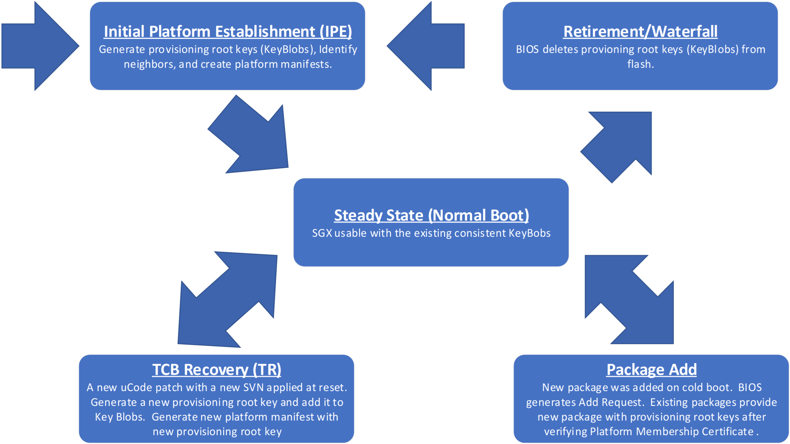

<!---
Copyright (C) 2025 Intel Corporation
SPDX-License-Identifier: CC-BY-4.0
-->

# Overview

## SGX Multi-Package Attestation Components

The infrastructure for supporting SGX multi-package registration includes the microcode of CPU packages, the BIOS, the registration platform software, and a registration authority service (Intel® SGX Registration Service).

### Microcode

Microcode is responsible for verifying that each CPU package is SGX-capable and making sure that each package has a consistent view of SGX-protected memory.
It also generates the common platform keys that each package uses for SGX key derivation.
Microcode is the only component that can generate the Provisioning Registration Key’s (PRK) private key based on the CPU package’s hardware key.
The PRK private key is unique to each CPU package and to the security version number (SVN) of the loaded microcode patch.

Microcode generates a data structure called key blob for each CPU package in the platform.
They contain shared platform keys and other information about the platform.
Each key blob is encrypted and MAC’d with the respective hardware key.
The key blobs are made available to the BIOS for persistent storage.
When BIOS presents a set of valid and matching key blobs to the microcode on subsequent boot flows, the platform can be booted with SGX enabled and without performing registration, and it can use the previously generated platform keys.

Microcode also generates a data structure called the platform manifest that contains information about all CPU packages in the platform, signatures from all CPU packages using the PRK private keys, and the platform keys encrypted with the Registration Server’s Encryption Key (RSEK).

Microcode can also share the platform keys with an added package once it has been certified by the registration authority service.

### BIOS

BIOS determines the boot flow based on the state of the available key blobs and on the security version number (SVN) of the microcode patch present at platform reset.
BIOS selects the value of SVN to use in the boot flow.
It can be equal to or lower than the value of the actual SVN of the loaded microcode patch, but it cannot be higher.
BIOS also collects the information about the registration authority service ([`SgxRegistrationServerID`][serverid]) and loads the microcode patch.

Once a platform has been established, BIOS stores the generated key blobs and uses them on subsequent boots.
This way the platform can boot with previously generated platform keys.

When the Add Package boot flow is selected (see [Add Package (Replace Package)][addPackage] for more details), BIOS generates the add request structure.
It also delivers the resulting platform membership certificate to the microcode to complete the Add Package flow.

BIOS provides and consumes information between the OS software layer using the UEFI variables that the [BIOS Multi-Package UEFI Variables][uefivar] appendix describes.

### Platform Software

The multi-package platform software essentially acts as network transport layer between the BIOS and the registration authority service.
It also acts as management software for the various boot flows.
The multi-package platform software runs in the OS context.
It can either run as an executable that starts up on every boot, or it can be a set of tools used by datacenter and CSP managers.
The way the software is used depends on the SGX server environment.

The bulk of this document describes the platform software delivered by Intel.

### Registration Authority Service

The registration authority service has three main functions:

- Validate platform manifests for the Initial Platform Establishment and TCB Recovery boot flows.
- Process add requests and generate platform membership certificates.
- Generate Platform Certification Key (PCK) certificates for registered platforms.

Each platform instance is related to only one registration authority service.
If a platform needs to register with a different registration authority service, new platform keys need to be generated.

When the registration authority service receives a platform manifest for a new platform, it makes sure all PRK signatures from all participating CPU packages come from valid SGX-enabled CPU packages in good standing.
The registration authority service contains a database of all PRK certificates generated by Intel.
If a PRK certificate is not found or the signature check fails, the registration authority service sends an error back to the platform software/BIOS, and that platform is not recorded in the service database.
If any of the PRK certificates are revoked, the service does not record the platform and responds with the appropriate error.
The service also checks that all platform CPU packages are compatible with one another and that the CPU package topology is valid.

If the platform is not recorded in the registration service, it cannot generate PCK certificates for that platform, so it prevents the platform from running remote attestation.
Note that the platform still has SGX enabled since the microcode and BIOS boot flow succeeded.
It just cannot run remote attestation.
If it succeeds, the platform is recorded in the registration service database and PCK certificate generation is possible.

When the registration authority service receives an add request, it verifies that a PRK certificate exists for the package’s PRID and CPUSVN.
If it exists, it verifies that it is not revoked.
Then it verifies that the package is consistent with the existing platform.
If all these checks pass, the registration authority service constructs the platform membership certificate and sends it back in the response.
The registration authority service does not check any signature on the add request since the add request is generated by BIOS, which does not have access to the PRK private key.
The platform manifest certificate contains the PRK public key and the platform information all signed by the Registration Server’s Authorization Key (RSAK).
When microcode completes Add Package flow, it uses the PRK public key to verify a PRK signature from the new package before providing it with the platform keys.

Software needs to communicate the platform manifests and the add requests to the registration authority service and process the responses.
Responses to platform manifests contain status information and the platform’s Platform Provisioning ID (PPID).
Responses to add requests contain status information and may also contain platform membership certificates.

To support multi-package platform remote attestation for SGX, the registration authority service needs to be capable of generating PCK certificates.
Once the encrypted platform keys for multi-package platforms are delivered to the registration authority service, the registration authority service uses its knowledge of the Provisioning Certification Enclave (PCE) identity to generate the PCK public key.

Intel hosts a registration authority service called the Intel® SGX Registration Service (Intel® SGX RS).
For more information on the Intel® SGX RS, see the [https://api.portal.trustedservices.intel.com/][TSAP]

## SGX Multi-Package States

The SGX platform keys for a multi-package platform have a lifecycle depending on the state of the boot flow.
This section provides a brief overview of each state.

/// figure-caption
Platform Key Life Cycle
///

The BIOS uses data structures called key blobs to determine the state of the platform.
The key blobs contain the platform keys that are negotiated for the platform.
Each CPU package needs to have a consistent key blob structure to boot successfully with SGX enabled.
BIOS stores the key blobs in persistent storage (FLASH).

### Initial Platform Establishment (IPE)

During the Initial Platform Establishment boot flow, the BIOS checks the key blobs for each CPU package to verify that they are all consistent with each other and the platform.
BIOS deletes the inconsistent key blobs.
If there are no key blobs or none of the key blobs are consistent with the current platform, BIOS provides no key blobs to microcode.
Microcode sees that there are no key blobs provided and generates new platform keys.
If BIOS selects to boot with microcode patch SVN that is equal to or less than the actual value of the SVN of the microcode patch loaded at reset, microcode generates platform keys for the provided SVN and all lower SVNs.
The new platform keys are randomly generated for this platform instance.
Each CPU package uses its HW key to encrypt the shared platform keys and generate a key blob.
BIOS stores the key blobs in flash for future boots.
Microcode also generates a new platform manifest for the new platform instance.
BIOS provides the new platform manifest to software via the [`SgxRegistrationServerRequest`][request] UEFI variable and indicates that a registration flow is required using the [`SgxRegistrationStatus`][status] UEFI variable.
The registration authority service must evaluate the new platform manifest before it can generate any PCK Certificates for the new platform.

### Normal

During normal boot, the BIOS checks the key blobs for each CPU package to verify they are all consistent with each other and the platform.
If the key blobs indicate that they contain the key for the SVN of the microcode patch loaded at reset, BIOS provides them to microcode.
Microcode verifies the key blobs for each package using the CPU packages’ respective HW key.
If microcode successfully verifies the key blobs, the registration authority service has nothing to verify, and it does not request the BIOS/software to do anything.
In this case, the platform uses the platform keys stored in the key blobs.

#### Microcode Downgrade

This is a special case of a Normal boot flow.
The BIOS checks the key blobs for each CPU package to verify that they are all consistent with each other and the platform.
In this case, the SVN of the microcode patch that is loaded at reset is lower than the highest platform key in the key blob.
This is supported, and the platform boots with the existing platform keys.
Microcode does not have access to the platform keys that are higher than the SVN of the microcode patch that is loaded at reset.

#### Removing CPU Packages

Removing CPU packages has no impact to the existing CPU packages or the platform keys.
This is a Normal boot flow.

#### Re-arranging CPU Packages

If the same set of CPU packages is in different sockets, BIOS and microcode recognize that the same CPU packages make up the platform and the platform keys are not recreated.
Rearranging the CPU packages is considered to be a Normal boot flow.

### TCB Recovery (TR/TCB-R)

During a TCB Recovery boot, the BIOS checks the key blobs to verify that they are all consistent with each other and the platform.
In this flow, the BIOS detects that the platform loaded a microcode patch at reset with a higher SVN than the highest platform key in any of the key blobs.
BIOS requests microcode boot at this new SVN.
Microcode sees that its SVN is greater than the highest SVN key in the key blobs and generates a new platform key for that SVN (and any platform keys between the highest in the key blob and the booting SVN).
These platform key(s) are shared with all the packages on the platform and added to each of key blobs.
Microcode also creates a new platform manifest that has the new platform key(s) added.
BIOS provides the platform manifest with the new platform key(s) to software via the [`SgxRegistrationServerRequest`][request] UEFI variable and indicates that a registration flow is required using the [`SgxRegistrationStatus`][status] UEFI variable.
The registration authority service must evaluate the new platform manifest before it can generate a PCK Certificate(s) at the new SVN level(s).

### Add Package (Replace Package)

During an Add Package flow, BIOS checks the key blobs to verify that they are consistent with each other and the platform.
In this flow, BIOS detects that at least one of the packages does not have a key blob or that its key blob is not consistent with the platform  (BIOS deletes the inconsistent key blobs).
BIOS then generates an add package request and disables SGX.
Since SGX is disabled, the microcode does not evaluate the existing key blobs.
BIOS provides the add package structure with the identity of the new package(s) to the platform software via the [`SgxRegistrationServerRequest`][request] UEFI variable and indicates that an Add Package flow is required using the [`SgxRegistrationStatus`][status] UEFI variable.
The registration authority must evaluate the add package structure before the microcode can share the existing platform keys to the new CPU package.
The registration authority service evaluates the add package request and generates a signed platform membership certificate(s) verifying that the CPU package(s) is authenticate and in good standing.
The platform membership certificate includes the PRK public key of the CPU package, and it is signed by the registration authority service’s RSAK.

The platform software then provides the platform membership certificate back to BIOS via the [SGXRegistrationServerResponse][serverresponse] UEFI variable.
The platform must then be rebooted.
Upon reboot, BIOS sees that a package is missing a key blob, and instead of disabling SGX, it provides the existing key blobs and the platform membership certificate(s) for the new CPU package(s) to microcode loader.
Microcode evaluates the key blobs and the platform membership certificate(s).
If everything verifies properly, the new CPU package is provided the platform keys and microcode creates a key blob for the new CPU package.
The platform then boots with SGX enabled.

If you do not want to support the Add Package flow, you can perform an SGX factory reset to erase the key blobs and force an Initial Platform Establishment flow when a new package is added or replaced.
You can also use the BIOS User Interface (UI) `SGX APB Support` setting to disable the Add Package boot flow.
With this disabled in BIOS, BIOS automatically enters the IPE flow instead of the Add Package flow when BIOS detects a new CPU package.

See the add package API supported by the Intel® Registration Service at [https://api.portal.trustedservices.intel.com/][TSAP].

### Retirement/Waterfall

The same collection of CPU packages can conduct IPE flows multiple times on the same physical platform.
This is useful for waterfalling/recycling.
Each IPE flow generates new platform keys and creates a new ‘platform instance’.
Each platform instance has its own platform keys and platform manifests.

There is a BIOS setting that allows the platform owner to perform a factory reset on the SGX state and settings.
This deletes all the key blobs for that platform and forces a new IPE flow.

## UEFI Variables and Tboot

When Intel® TXT is enabled and using TBOOT, the TBOOT loader will launch the Linux kernel with the `noefi` parameter.
This will disable the UEFI Runtime Services in the OS.
TBOOT does this because any component that runs before TBOOT executes the GETSEC[SENTER] instruction is not in the TCB (BIOS, MBR, GRUB bootloader, etc).
Any measurements made by these components are not trusted.
Since TXT does not measure the UEFI Runtime Services, TBOOT boots the Linux kernel with the `noefi` parameter.

As a result of the `noefi` parameter, the UEFI variables used to enable the flows described in [SGX Multi-Package States][multipackagestates] are not available.
This means the platform cannot complete the IPE, TR and Add Package flows when TBOOT is run.

When the platform needs to perform the IPE, TR and Add Package flows with TBOOT support, the kernel needs to boot without the `noefi` parameter, perform the operation, and reboot with TBOOT and the `noefi` parameter.

The impact of this restriction can be limited:

1. IPE flow:
    - The TBOOT provisioning stage requires a non-TBOOT OS flow and a reboot.
    - The IPE provision stage can happen during the same OS boot flow by reading the Platform Manifest from the UEFI variable
2. The Add Package
    - Requires a boot to the OS with SGX disabled.
    - During this boot, TBOOT can be disabled or boot without `noefi`.
    - Add Package requires a reboot to complete.
    - Next boot, TBOOT can be enabled and linux booted with  `noefi`.
3. TCB Recovery
    - The platform needs to reboot to perform a TCB Recovery since it requires a new uCode patch to be loaded at reset.
    - Without TBOOT, an additional reboot would not be required.<!-- markdownlint-disable-line MD033 -->
    - With TBOOT, TCB Recovery requires access to the UEFI variables.
        - After the uCode has been updated, you need to boot with out TBOOT or boot without `noefi` and collect the Platform Manifest from the UEFI variable.
        - Another reboot is required to re-enable TBOOT.<!-- markdownlint-disable-line MD033 -->
    - TCB Recoveries are generally limited to 2 times a year.

## Registration UEFI Variables in Read-only Mode

If the system was flashed with the BIOS that makes the Registration UEFI variables read-only, it means the software stack can NOT change the Registration UEFI variables value.
The impact to the IPE, Add Package and TCB Recovery boot flows are as follows:

1. IPE flow:
    - Can NOT change the UEFI variable `SGXRegistrationStatus`’ value.
    - When the system reboots, the BIOS will not know if the IPE registration completed successfully or terminally failed.
    The SW may try to process the PlatformManifest again.
2. The Add Package
    - Can NOT create UEFI variable `SgxRegistrationServerResponse`, so this scenario will NOT be supported by BIOS.
3. TCB Recovery
    - Can NOT change the UEFI variable `SGXRegistrationStatus`’ value.
    - When the system reboots, the BIOS will not know if the TCB Recovery registration completed successfully or terminally failed.
    The SW may try to process the PlatformManifest again

## SGX Multi-Package Registration Modes

Intel’s registration authority service (Intel® SGX Registration Service) supports two mechanisms for registering a platform.
This section describes these methods.

Note that SGX can be enabled and available even when the platform is not registered.
However, the platform cannot perform remote attestation until it is successfully registered.

### Direct Registration

In direct registration, the platform manifests are sent directly to the Intel® SGX Registration Service’s register API ([https://api.portal.trustedservices.intel.com/][TSAPRP]).
When you use this interface to register a platform, you implicitly give permission to store the encrypted platform keys in the Registration Service’s database.
When the Registration Service later generates a PCK Certificate, it sets the `Cached Keys` OID to `true` to indicate that the Registration Service is caching the encrypted platform keys.
You may use the ‘[Indirect Registration][indirect]’ method later, but it does not affect the value of the `Cached Keys` flag.
Once the `Cached Keys` flag is set in the Intel® SGX Registration Service, it cannot be reversed for that platform instance.

Registering the platform using direct registration allows requesting a PCK Certificate with just the platform’s Platform Provisioning ID (PPID) of the platform.
The PPID is derived from the platform keys and both the Registration Service and the Intel® SGX PCE can generate the PPID.
The PCK requester does not need to store the platform manifest once it is registered with the Registration Service.

### Indirect Registration

In indirect registration, the platform manifests are not sent directly to the Intel® SGX Registration Service.
Instead, the PCK Certificate is generated using the platform manifest as input, and the Registration Service only uses encrypted platform keys of the platform manifest long enough to generate the PCK Certificate.
It does not store them permanently.
It only stores platform metadata.
The PCK Certificates that are generated this way sets the `Cached Keys` OID to `false` to indicate that the Registration Service is not caching the encrypted platform keys.
If a platform manifest from the same platform instance is later sent to the Registration Service’s direct registration API, the Registration Service returns an error to maintain the consistency of the `Cached Keys` flag policy.
Once the `Cached Keys` flag is set in the Intel® SGX Registration Service, it cannot be reversed for that platform instance.

When you use this method, PCK Certificates cannot be requested using the PPID since the Registration Service does not have the platform keys required to generate PPID.
Instead, the platform manifest must be provided to generate the PCK Certificates.
You must maintain a copy of the platform manifests.

#### Intel® SGX Provisioning Certification Service (Intel® PCS)

The Intel® SGX Provisioning Certification Service offers APIs for retrieving PCK Certificates.
This service was introduced to support third party attestation for single package platforms.
It has been expanded to include support for multi-package platforms.
See [https://api.portal.trustedservices.intel.com][TSAP] for more information.

The new APIs support indirect registration by allowing the platform owner to request PCK Certificates using the platform manifest for multi-package platforms.

### Registration Environments

The registration environment, where the SGX platform runs, depends on the SGX server deployment flow that you use.
In some cases, the platforms are released as an end-user system and registration occurs in the customer environment with access to the internet.
The environments are mostly used for server workstations and some small enterprises.
For others, there are distinctly different operating environments for the provisioning phase and for the run-time phase of the platform lifetime.
For both environments, access to the internet is typically controlled, and therefore access to the registration authority service is not available to the SGX platform.

#### Single-Stage Registration

Typically, the registration authority service (such as the Intel® SGX Registration Service) is hosted on the Internet.
For platforms that have access to the Internet, the platform can simply register directly with registration when it first boots.
There is no need to proxy the registration, and registration can happen in a single stage.
In the single-stage environment, a software agent supporting server registration flows runs automatically at boot time.
It can check the BIOS UEFI interface for registration request data, send it to the registration authority service and then process the responses returned by the registration authority service accordingly.

Single-stage registration can satisfy small enterprises or server workstations that want a simpler registration flow and do not want to make large investments into registration infrastructure.
Platform owners can also use the single-stage environment to support a simple validation environment.
See using the [Multi-Package Registration Agent (MPA)][mpa] for more information on supporting this environment.

#### Dual-Stage Registration

In the dual-stage environment, the platform requiring registration does not have access to the Internet (and subsequently an externally hosted registration authority service).
Instead, there is a proxy that performs communication with the registration authority service on its behalf.
The platform can be moved to the run-time environment once the proxy successfully delivers the platform manifest to the registration service either directly or indirectly.

Currently, only the platform manifest retrieval is supported in the dual-stage environment since it does not require a response from the registration authority service to complete the flow.
The Add Package flow requires a response from the registration authority service (the platform membership certificate) to complete the flow and enable SGX.
Add Package flows may not be suitable for the dual-stage environment unless you can get immediate responses from the registration authority service or the platform can be provisioned with the platform membership certificate later.

See [PCK Cert ID Retrieval Tool][pckidretTool] for more information on supporting this environment.

[TSAP]:  https://api.portal.trustedservices.intel.com/
[TSAPRP]:  https://api.portal.trustedservices.intel.com/content/documentation.html#register-platform
[serverid]:  ../06/sgx_registration_configuration.md#sgx-registration-server-id
[addPackage]:  #add-package-replace-package
[uefivar]:  ../06/index.md#bios-multi-package-uefi-variables
[request]:  ../06/sgx_registration_server_request.md#sgx-registration-server-request
[status]:  ../06/sgx_registration_status.md#sgx-registration-status
[serverresponse]:  ../06/sgx_registration_server_response.md#sgx-registration-server-response
[multipackagestates]:  ../02/overview.md#sgx-multi-package-states
[indirect]:  ../02/overview.md#indirect-registration
[mpa]:  ../03/mp-reg-platform-sw-tools.md#multi-package-registration-agent-mpa
[pckidretTool]:  ../03/mp-reg-platform-sw-tools.md#pck-cert-id-retrieval-tool
