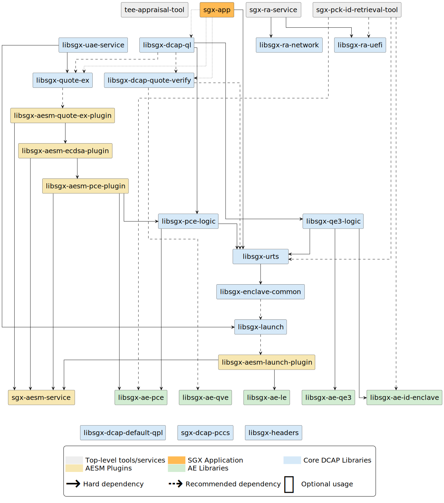
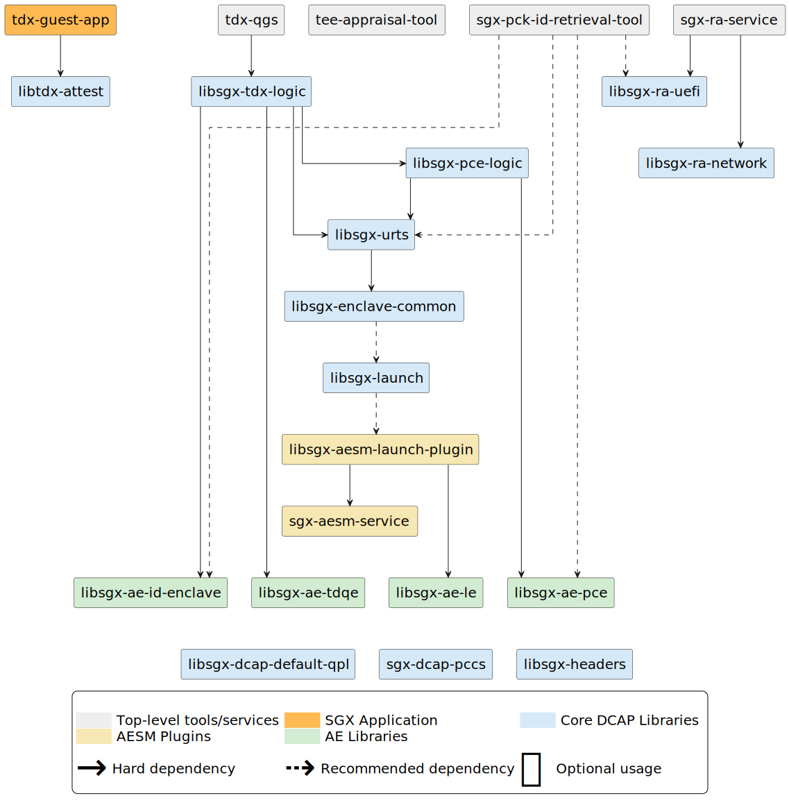

<!---
Copyright (C) 2025 Intel Corporation
SPDX-License-Identifier: CC-BY-4.0
-->

# Software Packages

In the following, we first describe the software packages used for Intel® SGX and Intel® TDX at a high level.
In later sections, the software packages are described in more details.

[Figure 1](#fig_package_structure_sgx) details the set of packages for Intel® SGX that are provided in Intel® SGX DCAP beginning with Version 1.4 and Intel® SGX PSW beginning with version 2.8.<!-- markdownlint-disable-line MD051 -->
The figure also displays required (hard) and optional dependencies between the packages.
The packages are categorized as follows:

- *SGX Library Packages* (in blue):
    Each package presents library functionality to application developers.
- *AESM Packages* (in yellow):
    Provide special security functions related to the Architectural Enclave Service Manager (AESM).
    The AESM is a daemon that provides special functions, e.g., quote generation or launch token generation, to Intel® SGX applications.
    The AESM has been modularized into a service, provided in the package *sgx-aesm-service*, and a set of plug-ins where each plug-in provides a specific function.
- *AE Packages* (in green):
    Packages related to Architectural Enclave (AE).


/// figure-caption
    attrs: {id: fig_package_structure_sgx}
Intel® SGX PSW and Intel® SGX/TDX DCAP for Linux Package Structure (Intel SGX related)
///

[Figure 2](#fig_package_structure_tdx) details the set of packages for Intel® TDX that are provided in Intel® SGX/TDX DCAP beginning with Version 1.14 and Intel® SGX PSW beginning with version 2.17.<!-- markdownlint-disable-line MD051 -->
The figure also displays required (hard) and optional dependencies between the packages.

In Intel TDX®, the packages are separated in two domains.
The first domain covers packages installed on host (or in a dedicated SGX VM or a docker container), e.g., `tdx-qgs`, `libsgx-dcap-default-qpl`, and `sgx-dcap-pccs`.
The second domain covers packages installed in the TD.
Applications that need to get a TD Report or a TD Quote depend on the package `libtdx-attest package`, which is the only package required inside the TD.


/// figure-caption
    attrs: {id: fig_package_structure_tdx}
Intel® SGX PSW and Intel® SGX/TDX DCAP for Linux Package Structure (Intel TDX related)
///


## Access to AESM Plug-ins

For an application to use a specific AESM function, the application installation must ensure that the plugin responsible for the AESM function is installed.
This can be done in one of two methods:

1. Set a direct dependency on the specified service's plug-in package.
    This installs the service in the environment where the application is installed.

2. Ensure that the plug-in is installed in an accessible environment where its service can be accessed.
    Each function that the AESM plug-ins provide can be accessed via a Unix Domain Socket with a hardcoded port.
    The plug-in may be installed in one environment, for example a container, and the Unix Domain Socket port may be relayed to an IP socket via a utility such as [SOCAT](https://linux.die.net/man/1/socat) so that it can be accessed in another environment (using a corresponding [SOCAT](https://linux.die.net/man/1/socat) configuration to relay the bytestream to the Unix Domain Socket).

Each AESM plug-in package depends on the AESM Service (*sgx-aesm-service*) and upon one or more Architectural Enclave (AE) packages.
AE packages provide enclaves themselves.
These enclaves, such as *libsgx-ae-pce,* are provided in their own packages to allow them:

- to be updated independently, as some are in the TCB of the Intel® SGX application due to the service they provide,
- to be signed by a trusted entity, as the signer of an AE must be trusted by the party relying on the AE service.

It should be noted that the packages *libsgx-dcap-default-qpl* and *sgx-dcap-pccs* are not presented with any direct dependencies.
These are described in a later section.


## Detailed Description of Packages

The best description of the individual components relates to what you need to do in an application or a run time, or how you may configure a VM or platform.
Each package and its dependencies are listed in alphabetical order in [](#tab_package_details).<!-- markdownlint-disable-line MD051 -->

<!-- markdownlint-disable MD033 -->

| **Package Name**                 | **Type**  | **Function**                                                    | **Direct SGX Package Dependency(s)**                                                                        | **Developer Files**                                     |
|----------------------------------|-----------|-----------------------------------------------------------------|-------------------------------------------------------------------------------------------------------------|---------------------------------------------------------|
| **libsgx-ae-pce**                | AE        | PCE Enclave                                                     | None                                                                                                        | EDL provided in release package                         |
| **libsgx-ae-qe3**                | AE        | ECDSA Quoting Enclave                                           | None                                                                                                        | EDL provided in release package                         |
| **libsgx-ae-qve**                | AE        | ECDSA Quote Verification Enclave                                | None                                                                                                        | EDL provided in release package                         |
| **libsgx-ae-id-enclave**         | AE        | ID Enclave                                                      | None                                                                                                        | EDL provided in release package                         |
| **libsgx-ae-tdqe**               | AE        | TDX Quoting Enclave                                             | None                                                                                                        | EDL provided in release package                         |
| **libsgx-aesm-ecdsa-plugin**     | Plug-in   | Plug-in to provide ECDSA Quotes                                 | `libsgx-qe3-logic`<br />`libsgx-aesm-pce-plugin`<br />`sgx-aesm-service`                                    |                                                         |
| **libsgx-aesm-pce-plugin**       | Plug-in   | Plug-in to provide PCE Signing                                  | `libsgx-pce-logic`<br />`libsgx-ae-pce`<br />`sgx-aesm-service`                                             |                                                         |
| **libsgx-aesm-quote-ex-plugin**  | Plug-in   | Plug-in to provide universal quoting                            | `libsgx-aesm-ecdsa-plugin`<br />`sgx-aesm-service`                                                          |                                                         |
| **libsgx-dcap-default-qpl**      | Lib       | Default Quote Provider Library (QPL)                            | None                                                                                                        | `libsgx-dcap-default-qpl-dev`                           |
| **libsgx-dcap-default-qpl-dev**  | Dev Files | Developer Files for Default Quote Provider Library              | `libsgx-dcap-default-qpl`                                                                                   |                                                         |
| **libsgx-dcap-ql**               | Lib       | Provides ECDSA Quotes                                           | `libsgx-pce-logic`<br />`libsgx-qe3-logic`<br />`libsgx-quote-ex`(opt.)<br />`libsgx-dcap-quote-verify`(opt.) | `libsgx-dcap-ql-dev`                                    |
| **libsgx-dcap-ql-dev**           | Dev Files | Developer Files for `libsgx-dcap-ql`                            | `libsgx-headers`<br />`libsgx-dcap-ql`                                                                      |                                                         |
| **libsgx-dcap-quote-verify**     | Lib       | Quote Verification Library                                      | `libsgx-urts`(opt.)<br />`libsgx-ae-qve`(opt.)                                                              | `libsgx-dcap-quote-verify-dev`                          |
| **libsgx-dcap-quote-verify-dev** | Dev Files | Developer files for Quote Verification Library                  | `libsgx-headers`<br />`libsgx-dcap-quote-verify`                                                            |                                                         |
| **libsgx-pce-logic**             | Lib       | Provides PCE logic wrapper                                      | `libsgx-urts`<br />`libsgx-ae-pce`                                                                          |                                                         |
| **libsgx-qe3-logic**             | Lib       | Provides ECDSA QE logic wrapper                                 | `libsgx-urts`<br />`libsgx-ae-qe3`<br />`libsgx-ae-id-enclave`                                                    |                                                         |
| **libsgx-tdx-logic**             | Lib       | Provides TD QE logic wrapper                                    | `libsgx-urts`<br />`libsgx-pce-logic`<br />`libsgx-ae-tdqe`<br />`libsgx-ae-id-enclave`                     | `libsgx-tdx-logic-dev`                                  |
| **libsgx-tdx-logic-dev**         | Dev Files | Developer Files for TD QE logic wrapper Library                 | `libsgx-tdx-logic`                                                                                          |                                                         |
| **libsgx-enclave-common**        | Lib       | Library that presents common interface for loading SGX enclaves |                                                                                                             | `libsgx-enclave-common-dev`                             |
| **libsgx-enclave-common-dev**    | Dev File  | Developer files for Enclave Common                              | `libsgx-headers`<br />`libsgx-enclave-common`                                                               |                                                         |
| **libsgx-quote-ex**              | Lib       | Provides agnostic quote generation                              | `libsgx-aesm-quote-ex-plugin` (opt.)                                                                        | `libsgx-quote-ex-dev`                                   |
| **libsgx-quote-ex-dev**          | Dev Files | Developer files for `libsgx-quote-ex`                           | `libsgx-headers`                                                                                            |                                                         |
| **libsgx-urts**                  | Lib       | Provides uRTS features to load/manage Intel® SGX Enclaves       | `libsgx-enclave-common`                                                                                     | Header files provided in SDK: `sgx_linux_x64_sdk_*.bin` |
| **sgx-aesm-service**             | Service   | AESM Service that runs AESM plug-ins                            | None                                                                                                        | None                                                    |
| **tdx-qgs**                      | Service   | TD Quoting Generation Service                                   | `libsgx-tdx-logic`                                                                                          |                                                         |
| **sgx-dcap-pccs**                | Service   | Provisioning Certificate Caching Service                        | None                                                                                                        |                                                         |
| **libtdx-attest**                | Lib       | Trust Domain Extensions Attestation library                     | None                                                                                                        | `libtdx-attest-dev`                                     |
| **libtdx-attest-dev**            | Dev Files | Developer files for `libtdx-attest`                             | `libtdx-attest`                                                                                             |                                                         |
<!-- markdownlint-enable MD033 -->

/// table-caption
    attrs: {id: tab_package_details}
Intel® Linux SGX Software Packages (note that package names may vary by distribution)
///


## FIPS 140-3 Certifiable mode

Some Intel SGX software components are built with OpenSSL3 static library.
To make them FIPS 140-3 Certifiable, you need to provide `openssl.cnf`, `fipsmodule.cnf`, and `fips.so` for your system.

1. Assuming your `fipsmodule.cnf` is located at `<path to fipsmodule.cnf>`, adjust the path in your `openssl.cnf` and make sure that you have all listed settings:

    ```console
    # For FIPS
    # Optionally include a file that is generated by the OpenSSL fipsinstall
    # application. This file contains configuration data required by the OpenSSL
    # fips provider. It contains a named section e.g. [fips_sect] which is
    # referenced from the [provider_sect] below.
    # Refer to the OpenSSL security policy for more information.
    .include <path to fipsmodule.cnf>/fipsmodule.cnf

    [openssl_init]
    providers = provider_sect

    # List of providers to load
    [provider_sect]
    # default = default_sect
    # The fips section name should match the section name inside the
    # included fipsmodule.cnf.
    fips = fips_sect
    base = base_sect
    ```

2. Assuming your `openssl.cnf` is at `<path to openssl.cnf>`, export the path as follows:

    ```console
    OPENSSL_CONF=<path to openssl.cnf>/openssl.cnf`
    ```

3. If you have your `fips.so` in `<path to fips.so>`, export the path as follows:

    ```console
    export OPENSSL_MODULES=<path to fips.so>
    ```

4. Since AESM is running as a daemon, you must add the following to lines to `/usr/lib/systemd/system/aesmd.service` in the `Service` settings:

    ```console
    Environment=OPENSSL_MODULES=<path to fips.so>
    Environment=OPENSSL_CONF=<path to openssl.cnf>/openssl.cnf
    ```

    An example of the entire `/usr/lib/systemd/system/aesmd.service`:

    ```console
    [Unit]
    Description=Intel(R) Architectural Enclave Service Manager
    After=syslog.target network.target auditd.service
    After=remount-dev-exec.service
    Wants=remount-dev-exec.service

    [Service]
    User=aesmd
    Type=forking
    Environment=NAME=aesm_service
    Environment=AESM_PATH=/opt/intel/sgx-aesm-service/aesm
    Environment=LD_LIBRARY_PATH=/opt/intel/sgx-aesm-service/aesm
    Environment=OPENSSL_MODULES=<path to fips.so>
    Environment=OPENSSL_CONF=<path to openssl.cnf>/openssl.cnf
    WorkingDirectory=/opt/intel/sgx-aesm-service/aesm
    PermissionsStartOnly=true
    ExecStartPre=/opt/intel/sgx-aesm-service/aesm/linksgx.sh
    ExecStartPre=/bin/mkdir -p /var/run/aesmd/
    ExecStartPre=/bin/chown -R aesmd:aesmd /var/run/aesmd/
    ExecStartPre=/bin/chmod 0755 /var/run/aesmd/
    ExecStartPre=/bin/chown -R aesmd:aesmd /var/opt/aesmd/
    ExecStartPre=/bin/chmod 0750 /var/opt/aesmd/
    ExecStart=/opt/intel/sgx-aesm-service/aesm/aesm_service
    InaccessibleDirectories=/home
    ExecReload=/bin/kill -SIGHUP $MAINPID
    Restart=on-failure
    RestartSec=15s
    DevicePolicy=closed
    DeviceAllow=/dev/isgx rw
    DeviceAllow=/dev/sgx rw
    DeviceAllow=/dev/sgx/enclave rw
    DeviceAllow=/dev/sgx/provision rw
    DeviceAllow=/dev/sgx_enclave rw
    DeviceAllow=/dev/sgx_provision rw
    [Install]
    WantedBy=multi-user.target
    ```

5. Restart AESM:

    ```console
    sudo systemctl daemon-reload
    sudo service aesmd restart
    ```

As a result, Intel SGX related libraries and tools will load `fips.so` and use the FIPS 140-3 Certifiable APIs.
More details about the OpenSSL fips module can be found in [its documentation](https://www.openssl.org/docs/manmaster/man7/fips_module.html).


## Required Packages per Use Cases

The packages that are required, either as application package dependencies or as platform dependencies, depend on the use case of the application and the platform environment.


### Load Custom Runtime-based Enclaves

The loading process for Intel® SGX enclaves with a custom configuration (e.g., enclaves produced using the Open Enclave SDK) should use the `libsgx-enclave-common` library.

- Package: `libsgx-enclave-common`
- Documentation:
    [Intel_SGX_Enclave_Common_Loader_API_Reference.pdf](https://download.01.org/intel-sgx/latest/dcap-latest/linux/docs/Intel_SGX_Enclave_Common_Loader_API_Reference.pdf)
- Comments:
    - This library is typically used by enclave runtimes, e.g., Open Enclave Loader or Intel® SGX uRTS.


### Load Intel® SGX SDK-based Enclaves

Enclaves that are produced using the Intel® SGX SDK are loaded and managed with the `libsgx-urts` library.

- Package: `libsgx-urts`
- Documentation: `Intel_SGX_Developer_Reference_Linux_<version>_Open_Source.pdf` from <https://download.01.org/intel-sgx/latest/linux-latest/docs/>
- Comments:
    - `libsgx-urts` depends on `libsgx-enclave-common`.
    - To use `libsgx-urts` in your application, install the Intel® SGX SDK for Linux following the [installation instructions](../02/installation_instructions.md#intel-sgx-application-user).


### Use DCAP-based Quote Generation

Applications that use DCAP-based Quote Generation (also referred to as ECDSA-based Quote Generation) should use the `libsgx-dcap-ql` library.

- Package: `libsgx-dcap-ql`
- Documentation: `Intel_SGX_Developer_Reference_Linux_<version>_Open_Source.pdf` from <https://download.01.org/intel-sgx/latest/linux-latest/docs/>
- Comments:
    - `libsgx-dcap-ql` directly depends on:
        - `libsgx-urts` (dependency not shown in [](#fig_package_structure_sgx) and [](#fig_package_structure_tdx))<!-- markdownlint-disable-line MD051 -->
        - `libsgx-ae-qve`
        - `libsgx-ae-qe3`
        - `libsgx-ae-pce`


### Use Universal Quote Generation

Applications that use Universal Quote Generation should use the `libsgx-quote-ex` library.

- Package: `libsgx-quote-ex`
- Documentation: `Intel_SGX_Developer_Reference_Linux_ <version>_Open_Source.pdf` from <https://download.01.org/intel-sgx/latest/linux-latest/docs/>
- Comments:
    - `libsgx-quote-ex` requires access to `libsgx-quote-ex-plugin`.
        This can be a hard dependency in the application package, or it can be provided independently on the platform.
        See section [Access to AESM Plug-ins](#access-to-aesm-plug-ins) for details.


### Use Attestation in a TD

Applications inside a TD that use attestation should use the `libtdx-attest` library.

- Package: `libtdx-attest`
- Comments:
    - The [TD Quote Generation](../../../intel-tdx-enabling-guide/07/trust_domain_at_runtime/#td-quote-generation) section of the [Intel TDX Enabling Guide](../../../intel-tdx-enabling-guide/01/introduction/) shows how the *TDX Quote Generation Sample* can be used to generate a TD Quote.
    This sample code uses the `libtdx-attest` package.


### Provide TD Quoting Service

To provide a TD Quoting service on an Intel TDX-enabled host, you should use the `tdx-qgs` service.

- Package: `tdx-qgs`
- Comments:
    - `tdx-qgs` requires `libsgx-tdx-logic` as a hard dependency.
    - It also requires a Quote Provider Library (QPL) at runtime to retrieve platform information.
    - It is up to the system administrator to install Intel's QPL `libsgx-dcap-default-qpl` or their own version.
    - The [Setup Quote Generation Service (QGS)](../../../intel-tdx-enabling-guide/05/host_os_setup/#setup-quote-generation-service-qgs) section of the [Intel TDX Enabling Guide](../../../intel-tdx-enabling-guide/01/introduction/) shows how to setup the QGS in the host OS.


### Platform uses PCCS-based Collateral Caching

ECDSA-based quote generation and quote verification require collateral provided by Intel® PCS. This collateral should be cached within the infrastructure using a collateral caching service.

Intel provides a reference Provisioning Certificate Caching Service (PCCS) in package `sgx-dcap-pccs`. In addition, it provides a reference library, the Quote Provider Library (QPL), in package `libsgx-dcap-default-qpl`, which is used by `libsgx-dcap-ql` and `libsgx-aesm-ecdsa-plugin` to obtain collateral from the PCCS.

- Package: `sgx-dcap-pccs` and `libsgx-dcap-default-qpl`
- Comments:
    - Infrastructure providers (e.g., CSPs) are likely to deploy their own QPL and collateral caching service.
    In this case, the platform should be provisioned with the infrastructure providers specific software.
    - The [Provisioning Certificate Caching Service (PCCS)](../../../intel-tdx-enabling-guide/02/infrastructure_setup/#provisioning-certificate-caching-service-pccs) section of the [Intel TDX Enabling Guide](../../../intel-tdx-enabling-guide/01/introduction/) shows how to install the PCCS.
