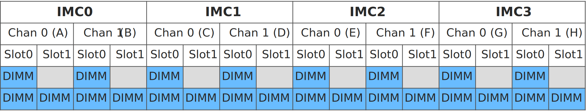

<!---
Copyright (C) 2024 Intel Corporation
SPDX-License-Identifier: CC-BY-4.0
-->

# Hardware Selection

On this page, we will explain what hardware is needed to enable Intel TDX.
This encompasses CPU requirements and DIMM requirements.
In most cases, the infrastructure provider is responsible for selecting the appropriate platform hardware.
Please talk to your OEM/ODM provider to receive a platform fulfilling the listed requirements.

## CPU Requirements

To enable Intel TDX, a [5th Gen Intel® Xeon® Scalable Processor](https://www.intel.com/content/www/us/en/products/docs/processors/xeon/5th-gen-xeon-scalable-processors.html) (code-named *Emerald Rapids*) is required.

## DIMM (i.e., main memory) Requirements

At minimum, all slot 0's of all Integrated Memory Controller (IMC) channels for all installed CPUs must be populated (i.e., 8 DIMMs per populated CPU socket, at least).
DIMM population must be symmetric across IMCs.

The following figure shows possible populations per populated CPU with 8 or 16 DIMMs:
<figure markdown>
  { loading=lazy }
  <figcaption>Possible memory configuration per populated CPU with 8 or 16 DIMMs</figcaption>
</figure>
